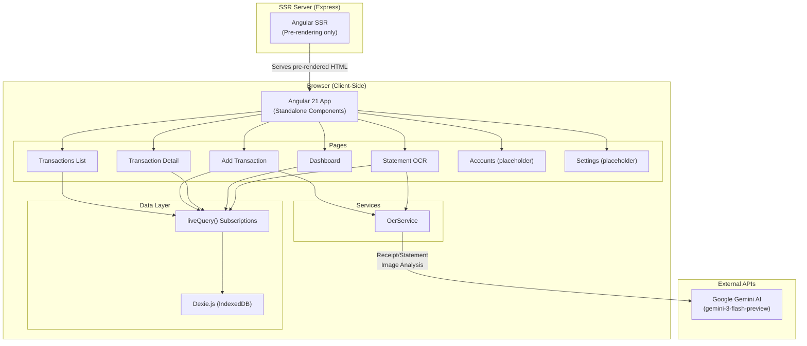

# Tech-Spec: FinTrack Pro — Architecture & Tech Assessment

**Created:** 2026-02-28

## Overview

### Problem Statement

FinTrack Pro was created in Google AI Studio and needs to be assessed for local development continuation. The team needs a clear understanding of the current architecture, tech stack, capabilities, gaps, and risks before deciding what to build next.

### Solution

Perform a comprehensive technical assessment covering: current architecture mapping, tech stack inventory, feature completeness audit, risk identification, and prioritized next steps.

### Scope

**In Scope:**
- Full source code review and architecture mapping
- Tech stack inventory with versions
- Feature completeness audit (implemented vs placeholder)
- Architecture diagram
- Backend/database/authentication assessment
- Risk and issue identification
- Prioritized recommendations

**Out of Scope:**
- Implementation of any new features
- Performance benchmarking or load testing
- Security penetration testing
- CI/CD pipeline setup

## Context for Development

### Current Architecture

### Key Architecture Facts

| Concern | Current State |
|---|---|
| **Backend API** | ❌ None (SSR-only Express server) |
| **Server Database** | ❌ None |
| **Client Database** | ✅ Dexie.js / IndexedDB (3 tables) |
| **Authentication** | ❌ None |
| **Data Sync** | ❌ No cross-device sync |
| **External APIs** | ✅ Google Gemini AI (OCR only) |
| **PWA** | ⚠️ Manifest only, no service worker |

### Database Schema (IndexedDB — Dexie.js)

| Table | Fields | Indexes |
|---|---|---|
| `transactions` | id, amount, description, category, account, source, date, type, receiptImage? | ++id, date, category, account, source, type |
| `accounts` | id, name | ++id, &name |
| `sources` | id, name | ++id, &name |

### Codebase Patterns

- **Standalone Components** — All components use `standalone: true` with per-component imports
- **Inline Templates** — All templates are inline (no separate .html files except root)
- **Angular Signals** — State managed via `signal()` and `computed()`
- **Reactive Data** — Dexie `liveQuery()` subscriptions feed signals
- **SSR Guards** — `isPlatformBrowser()` checks before any IndexedDB access
- **Structured AI Output** — Gemini `responseSchema` with `Type.OBJECT` / `Type.ARRAY` for typed OCR results
- **iOS Design System** — Custom Tailwind theme with `ios-blue`, `ios-bg`, `ios-card` tokens + utility classes (`.ios-card`, `.ios-btn-primary`, `.ios-input`)

### Files to Reference

| File | Purpose |
| ---- | ------- |
| `src/app/app.ts` | Root component — bottom tab navigation shell |
| `src/app/app.html` | Root template — router-outlet + iOS tab bar (5 tabs) |
| `src/app/app.routes.ts` | 7 routes (2 are placeholders pointing to Dashboard) |
| `src/app/db.ts` | Dexie database — Transaction, Account, Source interfaces + lazy singleton |
| `src/app/ocr.ts` | OcrService — Gemini AI receipt & statement processing |
| `src/app/dashboard.ts` | Dashboard — income/expense/balance/categories/trends/daily charts |
| `src/app/transactions.ts` | Transaction list — grouped by date, category icons |
| `src/app/add-transaction.ts` | Add transaction — manual form + Smart Scan + batch OCR |
| `src/app/transaction-detail.ts` | Edit/Delete transaction |
| `src/app/statement-ocr.ts` | Statement OCR — upload, preview, confirm-all |
| `src/styles.css` | Global styles — Tailwind config, iOS theme tokens, utility classes |
| `public/manifest.json` | PWA manifest (name, theme, icons) |
| `angular.json` | Build config — ⚠️ contains hardcoded API key |

### Technical Decisions

- **No backend by design** — The app was built as a client-only SPA in Google AI Studio, which doesn't support custom backends
- **IndexedDB chosen for offline-first** — All data persists locally without network dependency
- **Gemini AI for OCR** — Uses `gemini-3-flash-preview` model with structured output schema for reliable field extraction
- **SSR included but minimal** — Express server only pre-renders HTML, no API routes

## Identified Issues & Risks

### 🔴 Critical
1. **API Key Exposure** — Gemini API key hardcoded in `angular.json` build config, compiled into client bundle
2. **No Authentication** — Zero user management; data is accessible to anyone on the device

### 🟡 Moderate
3. **No Error Handling UI** — OCR failures only `console.error`, no user-facing feedback
4. **No Data Backup** — No export/import; data lost if browser storage cleared
5. **No Subscription Cleanup** — `liveQuery()` subscriptions not unsubscribed in `ngOnDestroy`
6. **Signal Mutation** — `removePending()` uses `splice()` (mutates array) before `set()`

### 🟢 Low
7. **Unused Dependencies** — `recharts`, `motion`, `lucide-angular` installed but not used
8. **Hardcoded Categories** — Only 6 fixed categories, no customization
9. **No Currency Config** — Defaults to USD despite Cambodia/ABA Bank context
10. **Generic Page Title** — `index.html` title is "Google AI Studio Angular App"

## Implemented Features Summary

### ✅ Fully Implemented (5 features)
1. Transaction CRUD (add, list, detail, edit, delete)
2. AI Receipt OCR (single + batch via Smart Scan)
3. Statement OCR (upload → extract → preview → confirm)
4. Dashboard Analytics (6 widgets: income, expense, balance, categories, monthly, daily)
5. Dynamic Account/Source Management (inline creation)

### ⏳ Placeholder (2 features)
6. Accounts Page — route exists, renders Dashboard as placeholder
7. Settings Page — route exists, renders Dashboard as placeholder

### ❌ Not Implemented (4 capabilities)
8. Camera Capture — metadata declares camera permission, only file upload works
9. PWA Service Worker — manifest exists, no SW registration
10. Data Export/Import
11. Search & Filtering

## Implementation Plan

### Tasks

#### Phase 1: Critical Security & Stability Fixes

- [ ] Task 1: Secure Gemini API key via backend proxy
  - File: `src/server.ts`
  - Action: Add a new Express API endpoint `POST /api/ocr` that accepts image data, calls the Gemini API server-side using `process.env.GEMINI_API_KEY`, and returns the structured OCR result to the client
  - Notes: This removes the API key from the client bundle entirely. The Express SSR server already exists, so we add routes to it.

- [ ] Task 2: Refactor OcrService to use backend proxy
  - File: `src/app/ocr.ts`
  - Action: Replace direct `@google/genai` calls with `fetch('/api/ocr', ...)` calls to the new backend endpoint. Remove the `GoogleGenAI` import from client code.
  - Notes: Maintain the same return types (`Transaction` fields). The `responseSchema` logic moves to the server.

- [ ] Task 3: Remove API key from angular.json build config
  - File: `angular.json`
  - Action: Remove `GEMINI_API_KEY` from `fileReplacements` or build environment config. Ensure it is only loaded server-side via `process.env`.
  - Notes: Verify the `cross-env` dev script still passes the key to the server process only.

- [ ] Task 4: Add error handling UI (toast notifications)
  - File: `src/app/app.ts` (new toast component or integrate into root)
  - Action: Create a simple toast/snackbar notification service using Angular Signals. Surface errors from OCR, database operations, and network failures as user-visible messages.
  - Notes: Follow the existing iOS design system. Use `ios-card` styling with error/success variants.

- [ ] Task 5: Fix subscription cleanup in all components
  - Files: `src/app/dashboard.ts`, `src/app/transactions.ts`, `src/app/add-transaction.ts`, `src/app/transaction-detail.ts`, `src/app/statement-ocr.ts`
  - Action: Implement `ngOnDestroy` in each component and unsubscribe from all `liveQuery()` subscriptions. Store subscription references in component properties.
  - Notes: Prevents memory leaks on navigation. Use the `Subscription` pattern or `DestroyRef` + `takeUntilDestroyed`.

- [ ] Task 6: Fix signal mutation in removePending()
  - File: `src/app/add-transaction.ts` or `src/app/statement-ocr.ts` (wherever `removePending` exists)
  - Action: Replace `splice()` mutation with immutable pattern: `set(current.filter((_, i) => i !== index))` or spread-based removal.
  - Notes: Signal values should never be mutated directly; always use `set()` with a new reference.

#### Phase 2: Core Feature Completion

- [ ] Task 7: Build Accounts management page
  - File: `src/app/accounts.ts` (new standalone component)
  - Action: Create a full Accounts page with: list all accounts, add new account (form), edit account name, delete account (with confirmation if transactions exist). Use Dexie `liveQuery()` for reactive data.
  - Notes: Follow existing iOS design patterns. Update `src/app/app.routes.ts` to point the accounts route to the new component instead of Dashboard.

- [ ] Task 8: Build Settings page
  - File: `src/app/settings.ts` (new standalone component)
  - Action: Create a Settings page with: default currency selection (USD/KHR), category management (add/edit/remove custom categories), data export (JSON), data import (JSON with validation), app info/version. Use Dexie for persistence.
  - Notes: Update `src/app/app.routes.ts` to point the settings route to the new component. Store settings in a new `settings` Dexie table.

- [ ] Task 9: Add settings table to Dexie schema
  - File: `src/app/db.ts`
  - Action: Add a `settings` table with schema `++id, key, &key` to store key-value pairs (e.g., `defaultCurrency`, `customCategories`). Bump the Dexie database version.
  - Notes: Include a `categories` table or store custom categories as a JSON array in the settings table. Provide a default seed of the existing 6 hardcoded categories.

- [ ] Task 10: Implement currency localization (KHR/USD)
  - File: `src/app/dashboard.ts`, `src/app/transactions.ts`, `src/app/transaction-detail.ts`, `src/app/add-transaction.ts`
  - Action: Read the `defaultCurrency` setting from Dexie. Replace all hardcoded `$` symbols and `USD` formatting with a currency formatter that supports both USD and KHR (Cambodian Riel, symbol: ៛).
  - Notes: KHR typically uses no decimal places. USD uses 2. Provide a shared utility function `formatCurrency(amount, currency)`.

#### Phase 3: Quality & Polish

- [ ] Task 11: Fix page title and PWA metadata
  - File: `src/index.html`, `public/manifest.json`
  - Action: Update `<title>` from "Google AI Studio Angular App" to "FinTrack Pro". Update manifest `name` and `short_name` accordingly.
  - Notes: Simple metadata fix.

- [ ] Task 12: Remove unused dependencies
  - File: `package.json`
  - Action: Uninstall `recharts`, `motion`, and `lucide-angular` via `npm uninstall`. Verify no imports reference them.
  - Notes: Reduces bundle size and eliminates confusion.

- [ ] Task 13: Add search & filtering to transactions list
  - File: `src/app/transactions.ts`
  - Action: Add a search bar (text filter on description) and filter controls (by category, account, source, date range, type). Use Angular Signals to maintain filter state. Apply filters to the `liveQuery()` result set using computed signals.
  - Notes: Follow iOS design system for filter chips/dropdowns.

### Acceptance Criteria

#### Phase 1: Security & Stability

- [ ] AC 1: Given the app is running, when the client JavaScript bundle is inspected, then no Gemini API key is present in the source code
- [ ] AC 2: Given a receipt image is submitted for OCR, when the backend proxy processes it, then the structured transaction data is returned to the client with the same fields as before
- [ ] AC 3: Given an OCR request fails (network error, invalid image, API quota), when the error occurs, then a user-visible toast notification displays with a meaningful error message
- [ ] AC 4: Given a user navigates between pages multiple times, when inspecting memory usage, then no liveQuery subscriptions are leaked (verified via DevTools)
- [ ] AC 5: Given a pending OCR item is removed, when the signal updates, then the original array reference is not mutated (immutable update)

#### Phase 2: Features

- [ ] AC 6: Given the user navigates to the Accounts tab, when the page loads, then a list of all accounts is displayed with options to add, edit, and delete
- [ ] AC 7: Given the user tries to delete an account that has associated transactions, when the delete is attempted, then a confirmation dialog warns about the association
- [ ] AC 8: Given the user navigates to Settings, when the page loads, then they can toggle currency between USD and KHR, manage categories, and export/import data
- [ ] AC 9: Given the user exports data as JSON, when they import it on a fresh browser, then all transactions, accounts, and sources are restored
- [ ] AC 10: Given the user sets the default currency to KHR, when viewing the dashboard and transaction list, then all amounts display with ៛ symbol and no decimal places

#### Phase 3: Polish

- [ ] AC 11: Given the app is loaded, when the browser tab is visible, then the title reads "FinTrack Pro" (not "Google AI Studio Angular App")
- [ ] AC 12: Given the dependencies are audited, when checking `package.json`, then `recharts`, `motion`, and `lucide-angular` are no longer listed
- [ ] AC 13: Given the user is on the transactions list, when they type in the search bar, then only transactions matching the description are shown
- [ ] AC 14: Given the user selects a category filter, when applied, then only transactions in that category are displayed

## Additional Context

### Dependencies

All dependencies are managed via npm. Key runtime dependencies:
- `@angular/*` — v21.0.0 (framework)
- `@google/genai` — v1.27.0 (AI OCR — moves to server-side only after Task 2)
- `dexie` — v4.3.0 (IndexedDB)
- `tailwindcss` — v4.1.12 (styling)

No new external dependencies are required. The backend proxy uses the existing Express server and `@google/genai` SDK already installed.

### Testing Strategy

- **Unit Tests** — Add Vitest tests for:
  - Currency formatting utility (`formatCurrency`)
  - Toast notification service (show/dismiss logic)
  - Settings service (read/write to Dexie)
- **Integration Tests** — Add Vitest tests for:
  - Backend OCR proxy endpoint (mock Gemini API, verify request/response shape)
  - Data export/import round-trip (export → clear → import → verify)
- **Manual Testing**:
  - Verify API key is not in client bundle (DevTools Sources → search for key)
  - Test OCR flow end-to-end through the new backend proxy
  - Test currency switching between USD and KHR across all pages
  - Test Accounts and Settings pages on mobile viewport
  - Verify no console errors on page navigation (subscription cleanup)

### Notes

- The app was originally created in [Google AI Studio](https://ai.studio/apps/f68eb152-07cf-4a24-9a66-8bc3ec952673)
- The `dev` script uses `cross-env` to pass `GEMINI_API_KEY` at build time
- The Express server (`src/server.ts`) handles SSR but no custom API endpoints
- All components use OnPush-style patterns but only `app.ts` explicitly declares `ChangeDetectionStrategy.OnPush`
- **High-Risk Items:**
  - Dexie version bump (Task 9) may require migration logic if users have existing IndexedDB data
  - Moving `@google/genai` to server-side only (Task 2) changes the OCR latency profile — monitor for timeouts
- **Future Considerations (Out of Scope):**
  - Authentication & multi-user support
  - Cloud sync / cross-device data
  - PWA service worker for offline caching
  - Camera capture integration
  - Dark mode theme

## Recommended Next Steps

| Priority | Item | Effort |
|---|---|---|
| 🔴 P1 | Secure API key (backend proxy or env-only) | Medium |
| 🔴 P1 | Add error handling UI (toasts/alerts) | Small |
| 🟡 P2 | Build Accounts page | Medium |
| 🟡 P2 | Build Settings page | Medium |
| 🟡 P2 | Currency localization (KHR/USD) | Small |
| 🟡 P2 | Custom categories | Small |
| 🟢 P3 | Data export/import (JSON/CSV) | Medium |
| 🟢 P3 | Search & filtering | Medium |
| 🟢 P3 | PWA service worker | Medium |
| 🟢 P3 | Camera integration | Small |
| 🟢 P3 | Dark mode | Medium |
| 🟢 P3 | Remove unused deps | Small |
